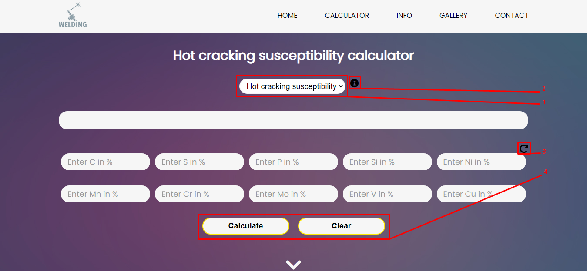

# Hot cracking susceptibility calculator
*You can see page by following this [link](https://maxfeshchuk.github.io/calc/)*
## How the calculator works

The calculator contains 4 functionalities:

1. select (not working now)
2. [info](#Info)
3. [reset](#Reset)
4. [button "Calculate" and "Clear"](https://github.com/MaxFeshchuk/MaxFeshchuk.github.io/#L25)
	- [Button "Calculate"](#Button Calculate)
	- [Button "Clear"](#Button Clear)

### Info

Click on this icon and you get a some hint.  

### Reset

The site remembers the last entered data. 
If you want to reset them please click on this icon.

### Button "Calculate" and "Clear"

#### Button "Calculate"

First you need to find the composition of the required steel.  

Then, if the fields are not empty, click "reret" or button "clear".  
Ok, you are ready. Fill in the appropriate fields on the site. 

Now press the button "Calculate"!  

Congratulations! You calculated the susceptibility of steel to cracking.

#### Button "Clear"

If there is a situation that you want to clear the fields, press the button "Clear"
and fields empty again.  

So far, these are all available features. Thank you for attention.